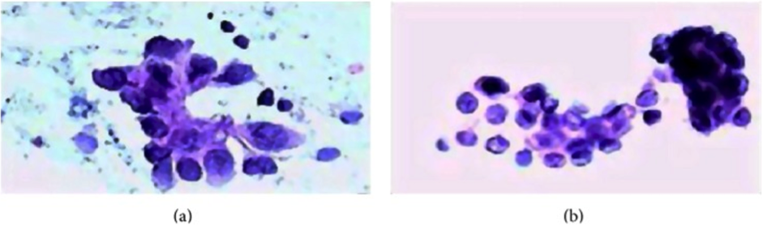

```{r setup, include=FALSE}
knitr::opts_chunk$set(echo = TRUE)
```

The dataset can be downloaded from the [UC Irvine Machine Learning Repository] (https://archive.ics.uci.edu/ml/machine-learning-databases/breast-cancer-wisconsin/). They have been collected by Dr. William H. Wolberg (1989–1991) at the University of Wisconsin–Madison Hospitals. The features in these datasets characterise cell nucleus properties and were generated from image analysis of fine needle aspirates (FNA) of breast masses. This test involves fluid extraction from a breast mass using a small gauge needle and then visual inspection of the fluid under a microscope. 
The role of diagnosis is to provide a distinction between the malignant and benign breast masses.


FNA biopsies of breast. Malignant (a) and benign (b) breast tumors, from https://www.ncbi.nlm.nih.gov/pubmed/8168063

The dataset is small with only 9 features, the other two datasets have 30 and 33 features.

The dataset looks at the two predictor **classes** (last column):
* malignant (4) or benign breast mass (2)
The phenotypes for characterisation are:
* Sample ID (code number)
* Clump thickness
* Uniformity of cell size
* Uniformity of cell shape
* Marginal adhesion
* Single epithelial cell size
* Number of bare nuclei
* Bland chromatin
* Number of normal nuclei
* Mitosis
* **Classes, i.e. diagnosis**

## Data loading
```{r}
bc_data <- read.table("breast-cancer-wisconsin.data.txt", header = FALSE, sep = ",")
colnames(bc_data) <- c("sample_code_number", "clump_thickness", "uniformity_of_cell_size", "uniformity_of_cell_shape", "marginal_adhesion", "single_epithelial_cell_size", 
                       "bare_nuclei", "bland_chromatin", "normal_nucleoli", "mitosis", "classes")
bc_data$classes <- ifelse(bc_data$classes == "2", "benign",
                          ifelse(bc_data$classes == "4", "malignant", NA))
bc_data[bc_data == "?"] <- NA
```


## Data QC
```{r}
length(which(is.na(bc_data)))
```
## Missing data resolution
```{r}
library(mice)

bc_data[,2:10] <- apply(bc_data[, 2:10], 2, function(x) as.numeric(as.character(x)))
dataset_impute <- mice(bc_data[, 2:10],  print = FALSE)
bc_data <- cbind(bc_data[, 11, drop = FALSE], mice::complete(dataset_impute, 1))

bc_data$classes <- as.factor(bc_data$classes)
```

## Classes instances summary
```{r}
summary(bc_data$classes)
```

## Data summary
```{r}
str(bc_data)
```

##Feature reduction:selection
###Principal Component Analysis (PCA)

### plotting theme
```{r}
library(ggplot2)
my_theme <- function(base_size = 12, base_family = "sans"){
  theme_minimal(base_size = base_size, base_family = base_family) +
  theme(
    axis.text = element_text(size = 12),
    axis.text.x = element_text(angle = 0, vjust = 0.5, hjust = 0.5),
    axis.title = element_text(size = 14),
    panel.grid.major = element_line(color = "grey"),
    panel.grid.minor = element_blank(),
    panel.background = element_rect(fill = "aliceblue"),
    strip.background = element_rect(fill = "navy", color = "navy", size = 1),
    strip.text = element_text(face = "bold", size = 12, color = "white"),
    legend.position = "right",
    legend.justification = "top", 
    legend.background = element_blank(),
    panel.border = element_rect(color = "grey", fill = NA, size = 0.5)
  )
}

theme_set(my_theme())
```

### function for PCA plotting
```{r, message=FALSE, warning=FALSE}
library(pcaGoPromoter)
library(ellipse)
pca_func <- function(data, groups, title, print_ellipse = TRUE) {
  
  # perform pca and extract scores
  pcaOutput <- pca(data, printDropped = FALSE, scale = TRUE, center = TRUE)
  pcaOutput2 <- as.data.frame(pcaOutput$scores)
  
  # define groups for plotting
  pcaOutput2$groups <- groups
  
  # when plotting samples calculate ellipses for plotting (when plotting features, there are no replicates)
  if (print_ellipse) {
    
    centroids <- aggregate(cbind(PC1, PC2) ~ groups, pcaOutput2, mean)
    conf.rgn  <- do.call(rbind, lapply(unique(pcaOutput2$groups), function(t)
      data.frame(groups = as.character(t),
                 ellipse(cov(pcaOutput2[pcaOutput2$groups == t, 1:2]),
                       centre = as.matrix(centroids[centroids$groups == t, 2:3]),
                       level = 0.95),
                 stringsAsFactors = FALSE)))
    
    plot <- ggplot(data = pcaOutput2, aes(x = PC1, y = PC2, group = groups, color = groups)) + 
      geom_polygon(data = conf.rgn, aes(fill = groups), alpha = 0.2) +
      geom_point(size = 2, alpha = 0.6) + 
      scale_color_brewer(palette = "Set1") +
      labs(title = title,
           color = "",
           fill = "",
           x = paste0("PC1: ", round(pcaOutput$pov[1], digits = 2) * 100, "% variance"),
           y = paste0("PC2: ", round(pcaOutput$pov[2], digits = 2) * 100, "% variance"))
    
  } else {
    
    # if there are fewer than 10 groups (e.g. the predictor classes) I want to have colors from RColorBrewer
    if (length(unique(pcaOutput2$groups)) <= 10) {
      
      plot <- ggplot(data = pcaOutput2, aes(x = PC1, y = PC2, group = groups, color = groups)) + 
        geom_point(size = 2, alpha = 0.6) + 
        scale_color_brewer(palette = "Set1") +
        labs(title = title,
             color = "",
             fill = "",
             x = paste0("PC1: ", round(pcaOutput$pov[1], digits = 2) * 100, "% variance"),
             y = paste0("PC2: ", round(pcaOutput$pov[2], digits = 2) * 100, "% variance"))
      
    } else {
      
      # otherwise use the default rainbow colors
      plot <- ggplot(data = pcaOutput2, aes(x = PC1, y = PC2, group = groups, color = groups)) + 
        geom_point(size = 2, alpha = 0.6) + 
        labs(title = title,
             color = "",
             fill = "",
             x = paste0("PC1: ", round(pcaOutput$pov[1], digits = 2) * 100, "% variance"),
             y = paste0("PC2: ", round(pcaOutput$pov[2], digits = 2) * 100, "% variance"))
      
    }
  }
  
  return(plot)
  
}

library(gridExtra)
library(grid)
```

```{r,fig.width=13, fig.height=6}
p1 <- pca_func(data = t(bc_data[, 2:10]), groups = as.character(bc_data$classes), title = "Breast cancer dataset 1: Samples")
p2 <- pca_func(data = bc_data[, 2:10], groups = as.character(colnames(bc_data[, 2:10])), title = "Breast cancer dataset 1: Features", print_ellipse = FALSE)
grid.arrange(p1, p2, ncol = 2)
```


```{r}
h_1 <- hclust(dist(t(bc_data[, 2:10]), method = "euclidean"), method = "complete")
plot(h_1)
```

```{r fig.width=13, fig.height=9, message=FALSE}
library(ggplot2)
library(tidyr)
bc_data_gather <- bc_data %>%
  gather(measure, value, clump_thickness:mitosis)

ggplot(data = bc_data_gather, aes(x = value, fill = classes, color = classes)) +
  geom_density(alpha = 0.3, size = 1) +
  geom_rug() +
  scale_fill_brewer(palette = "Set1") +
  scale_color_brewer(palette = "Set1") +
  facet_wrap( ~ measure, scales = "free_y", ncol = 3)
```


## Feature importance
To get an idea about the feature’s respective importances we will use a Random Forest models with 10 x 10 cross validation using the caret package. 

```{r, message=FALSE}
library(caret)
library(doParallel) # parallel processing
registerDoParallel()

# prepare training scheme
control <- trainControl(method = "repeatedcv", number = 10, repeats = 10)

feature_imp <- function(model, title) {
  
  # estimate variable importance
  importance <- varImp(model, scale = TRUE)
  
  # prepare dataframes for plotting
  importance_df_1 <- importance$importance
  importance_df_1$group <- rownames(importance_df_1)
  
  importance_df_2 <- importance_df_1
  importance_df_2$Overall <- 0
  
  importance_df <- rbind(importance_df_1, importance_df_2)
  
  plot <- ggplot() +
    geom_point(data = importance_df_1, aes(x = Overall, y = group, color = group), size = 2) +
    geom_path(data = importance_df, aes(x = Overall, y = group, color = group, group = group), size = 1) +
    theme(legend.position = "none") +
    labs(
      x = "Importance",
      y = "",
      title = title,
      subtitle = "Scaled feature importance determined with Random Forest and
    repeated cross validation (10 repeats, 10 times)"
    )
  
  return(plot)
  
}
```

```{r, message=FALSE, warning=FALSE}
# train the model
set.seed(27)
imp_1 <- train(classes ~ ., data = bc_data, method = "rf", preProcess = c("scale", "center"), trControl = control)
```

```{r}
p1 <- feature_imp(imp_1, title = "Breast cancer dataset 1")
plot(p1)
```

# Feature Selection
We will run three feature selection methods and compare how they effect the prediction accuracy of a Random Forest model.
## Creating train and test data
We need to subset the dataset into train and test data in order to run the whole modeling process on the training data alone

```{r}
set.seed(27)
bc_data_index <- createDataPartition(bc_data$classes, p = 0.7, list = FALSE)
bc_data_train <- bc_data[bc_data_index, ]
bc_data_test  <- bc_data[-bc_data_index, ]
```

## Correlation
By eliminating highly correlated features we can avoid a predictive bias. We need to keep in mind that just because they are suitable to predicting an outcome they are not necessarily causal - they could simply be correlated with causal factors.
Correlations between all features are calculated and visualised with the corrplot package. I am then removing all features with a correlation higher than 0.7, keeping the feature with the lower mean.

```{r}
library(corrplot)
# calculate correlation matrix
corMatMy <- cor(bc_data_train[, -1])
corrplot(corMatMy, order = "hclust")
```

```{r}
#Apply correlation filter at 0.70
highlyCor <- colnames(bc_data_train[, -1])[findCorrelation(corMatMy, cutoff = 0.7, verbose = TRUE)]
```
```{r}
# which variables are flagged for removal?
highlyCor
```

```{r}
#then we remove these variables
bc_data_cor <- bc_data_train[, which(!colnames(bc_data_train) %in% highlyCor)]
```
Correlation between features in dataset 1 is high and 4 out of 10 features were flagged for removal.

## Recursive Feature Elimination (RFE)
RFE uses a Random Forest algorithm to test combinations of features and rate each with an accuracy score. The combination with the highest score is usually preferential.

```{r}
# ensure the results are repeatable
set.seed(7)
# define the control using a random forest selection function with cross validation
control <- rfeControl(functions = rfFuncs, method = "cv", number = 10)

# run the RFE algorithm
results_1 <- rfe(x = bc_data_train[, -1], y = bc_data_train$classes, sizes = c(1:9), rfeControl = control)

# chosen features
predictors(results_1)
```

```{r}
# subset the chosen features
bc_data_rfe <- bc_data_train[, c(1, which(colnames(bc_data_train) %in% predictors(results_1)))]
```


## Genetic Algorithm (GA)
The Genetic Algorithm (GA) has been developed based on evolutionary principles of natural selection: It aims to optimize a population of individuals with a given set of genotypes by modeling selection over time. In each generation (i.e. iteration), each individual’s fitness is calculated based on their genotypes. Then, the fittest individuals are chosen to produce the next generation. This subsequent generation of individuals will have genotypes resulting from (re-) combinations of the parental alleles. These new genotypes will again determine each individual’s fitness. This selection process is iterated for a specified number of generations and (ideally) leads to fixation of the fittest alleles in the gene pool.
This concept of optimization can be applied to non-evolutionary models as well, like feature selection processes in machine learning.
For demonstration purposes I am using only 10 generations consisting of 5 individuals. More iterations with larger populations would of course be preferable, but this takes quite long to run!

```{r, message=FALSE, warning=FALSE}
library(dplyr)

ga_ctrl <- gafsControl(functions = rfGA, # Assess fitness with RF
                       method = "cv",    # 10 fold cross validation
                       genParallel = TRUE, # Use parallel programming
                       allowParallel = TRUE)
```

```{r}
lev <- c("malignant", "benign")     # Set the levels

set.seed(27)
model_1 <- gafs(x = bc_data_train[, -1], y = bc_data_train$classes,
                   iters = 10, # generations of algorithm
                   popSize = 5, # population size for each generation
                   levels = lev,
                   gafsControl = ga_ctrl)
```

```{r}
plot(model_1) # Plot mean fitness (AUC) by generation
```

```{r}
model_1$ga$final
```

```{r}
bc_data_ga <- bc_data_train[, c(1, which(colnames(bc_data_train) %in% model_1$ga$final))]
```

# Testing feature selection models against a RF model
## All features

```{r}
set.seed(27)
model_bc_data_all <- train(classes ~ .,
                           data = bc_data_train,
                           method = "rf",
                           preProcess = c("scale", "center"),
                           trControl = trainControl(method = "repeatedcv", number = 5, repeats = 10, verboseIter = FALSE))
```

```{r}
cm_all_1 <- confusionMatrix(predict(model_bc_data_all, bc_data_test[, -1]), bc_data_test$classes)
cm_all_1
```

## Selected features
### Correlation

```{r}
set.seed(27)
model_bc_data_cor <- train(classes ~ .,
                 data = bc_data_cor,
                 method = "rf",
                 preProcess = c("scale", "center"),
                 trControl = trainControl(method = "repeatedcv", number = 5, repeats = 10, verboseIter = FALSE))
```

```{r}
cm_cor_1 <- confusionMatrix(predict(model_bc_data_cor, bc_data_test[, -1]), bc_data_test$classes)
cm_cor_1
```

### RFE

```{r}
set.seed(27)
model_bc_data_rfe <- train(classes ~ .,
                           data = bc_data_rfe,
                           method = "rf",
                           preProcess = c("scale", "center"),
                           trControl = trainControl(method = "repeatedcv", number = 5, repeats = 10, verboseIter = FALSE))
```

```{r}
cm_rfe_1 <- confusionMatrix(predict(model_bc_data_rfe, bc_data_test[, -1]), bc_data_test$classes)
cm_rfe_1
```

### GA

```{r}
set.seed(27)
model_bc_data_ga <- train(classes ~ .,
                           data = bc_data_ga,
                           method = "rf",
                           preProcess = c("scale", "center"),
                           trControl = trainControl(method = "repeatedcv", number = 5, repeats = 10, verboseIter = FALSE))
```

```{r}
cm_ga_1 <- confusionMatrix(predict(model_bc_data_ga, bc_data_test[, -1]), bc_data_test$classes)
cm_ga_1
```

# Overall model parameters
To compare the feature selection methods’ influence owe will plot model accuracy, kappa, precision and sensitivity and specificity.

```{r}
overall <- data.frame(dataset = rep(c("1"), each = 4),
                      model = rep(c("all", "cor", "rfe", "ga")),
                      rbind(cm_all_1$overall,
                      cm_cor_1$overall,
                      cm_rfe_1$overall,
                      cm_ga_1$overall))

library(tidyr)
overall_gather <- overall[, 1:4] %>%
  gather(measure, value, Accuracy:Kappa)
```

```{r}
byClass <- data.frame(dataset = rep(c("1"), each = 4),
                      model = rep(c("all", "cor", "rfe", "ga")),
                      rbind(cm_all_1$byClass,
                      cm_cor_1$byClass,
                      cm_rfe_1$byClass,
                      cm_ga_1$byClass))

byClass_gather <- byClass[, c(1:4, 7)] %>%
  gather(measure, value, Sensitivity:Precision)
```

```{r, fig.height=10, fig.width=10}
overall_byClass_gather <- rbind(overall_gather, byClass_gather)
overall_byClass_gather <- within(overall_byClass_gather, model <- factor(model, levels = c("all", "cor", "rfe", "ga")))

ggplot(overall_byClass_gather, aes(x = model, y = value, color = measure, shape = measure, group = measure)) +
  geom_point(size = 4, alpha = 0.8) +
  geom_path(alpha = 0.7) +
  scale_colour_brewer(palette = "Set1") +
  facet_grid(dataset ~ ., scales = "free_y") +
  labs(
    x = "Feature Selection method",
    y = "Value",
    color = "",
    shape = "",
    title = "Comparison of feature selection methods",
    caption = "\nBreast Cancer Wisconsin (Diagnostic) Data Set 1
    Street et al., 1993;
    all: no feature selection
    cor: features with correlation > 0.7 removed
    rfe: Recursive Feature Elimination
    ga: Genetic Algorithm"
  )
```

