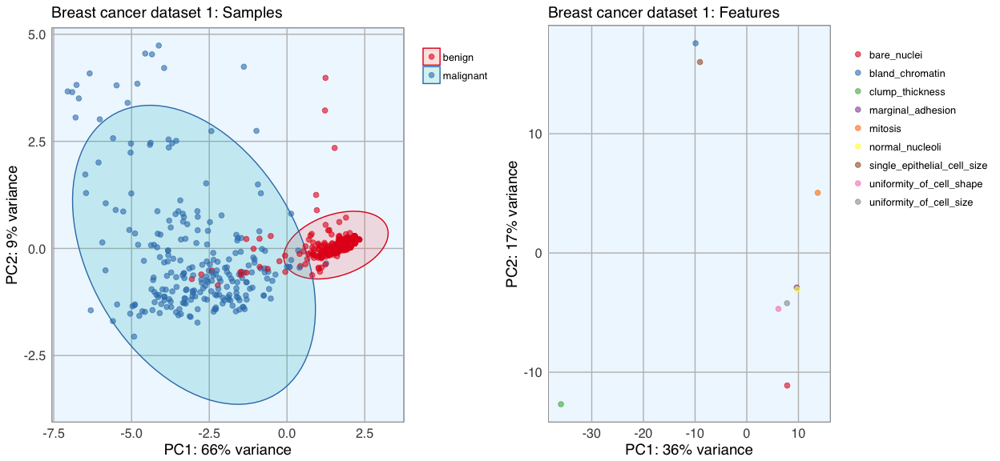
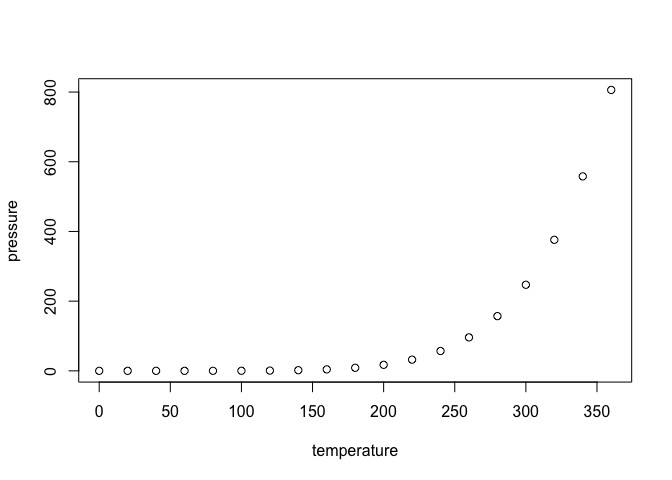

Untitled
================

GitHub Documents
----------------

This is an R Markdown format used for publishing markdown documents to GitHub. When you click the **Knit** button all R code chunks are run and a markdown file (.md) suitable for publishing to GitHub is generated.

Including Code
--------------

You can include R code in the document as follows:

``` r
summary(cars)
```

    ##      speed           dist       
    ##  Min.   : 4.0   Min.   :  2.00  
    ##  1st Qu.:12.0   1st Qu.: 26.00  
    ##  Median :15.0   Median : 36.00  
    ##  Mean   :15.4   Mean   : 42.98  
    ##  3rd Qu.:19.0   3rd Qu.: 56.00  
    ##  Max.   :25.0   Max.   :120.00

Data loading
------------

``` r
bc_data <- read.table("breast-cancer-wisconsin.data.txt", header = FALSE, sep = ",")
colnames(bc_data) <- c("sample_code_number", "clump_thickness", "uniformity_of_cell_size", "uniformity_of_cell_shape", "marginal_adhesion", "single_epithelial_cell_size", 
                       "bare_nuclei", "bland_chromatin", "normal_nucleoli", "mitosis", "classes")
bc_data$classes <- ifelse(bc_data$classes == "2", "benign",
                          ifelse(bc_data$classes == "4", "malignant", NA))
bc_data[bc_data == "?"] <- NA
```

Data QC
-------

``` r
length(which(is.na(bc_data)))
```

    ## [1] 16

Missing data resolution
-----------------------

``` r
library(mice)

bc_data[,2:10] <- apply(bc_data[, 2:10], 2, function(x) as.numeric(as.character(x)))
dataset_impute <- mice(bc_data[, 2:10],  print = FALSE)
bc_data <- cbind(bc_data[, 11, drop = FALSE], mice::complete(dataset_impute, 1))

bc_data$classes <- as.factor(bc_data$classes)
```

Classes instances summary
-------------------------

``` r
summary(bc_data$classes)
```

    ##    benign malignant 
    ##       458       241

Data summary
------------

``` r
str(bc_data)
```

    ## 'data.frame':    699 obs. of  10 variables:
    ##  $ classes                    : Factor w/ 2 levels "benign","malignant": 1 1 1 1 1 2 1 1 1 1 ...
    ##  $ clump_thickness            : num  5 5 3 6 4 8 1 2 2 4 ...
    ##  $ uniformity_of_cell_size    : num  1 4 1 8 1 10 1 1 1 2 ...
    ##  $ uniformity_of_cell_shape   : num  1 4 1 8 1 10 1 2 1 1 ...
    ##  $ marginal_adhesion          : num  1 5 1 1 3 8 1 1 1 1 ...
    ##  $ single_epithelial_cell_size: num  2 7 2 3 2 7 2 2 2 2 ...
    ##  $ bare_nuclei                : num  1 10 2 4 1 10 10 1 1 1 ...
    ##  $ bland_chromatin            : num  3 3 3 3 3 9 3 3 1 2 ...
    ##  $ normal_nucleoli            : num  1 2 1 7 1 7 1 1 1 1 ...
    ##  $ mitosis                    : num  1 1 1 1 1 1 1 1 5 1 ...

Feature reduction:selection
---------------------------

### Principal Component Analysis (PCA)

plotting theme
==============

``` r
library(ggplot2)
my_theme <- function(base_size = 12, base_family = "sans"){
  theme_minimal(base_size = base_size, base_family = base_family) +
  theme(
    axis.text = element_text(size = 12),
    axis.text.x = element_text(angle = 0, vjust = 0.5, hjust = 0.5),
    axis.title = element_text(size = 14),
    panel.grid.major = element_line(color = "grey"),
    panel.grid.minor = element_blank(),
    panel.background = element_rect(fill = "aliceblue"),
    strip.background = element_rect(fill = "navy", color = "navy", size = 1),
    strip.text = element_text(face = "bold", size = 12, color = "white"),
    legend.position = "right",
    legend.justification = "top", 
    legend.background = element_blank(),
    panel.border = element_rect(color = "grey", fill = NA, size = 0.5)
  )
}

theme_set(my_theme())
```

### function for PCA plotting

``` r
library(pcaGoPromoter)
```

    ## Loading required package: ellipse

    ## Loading required package: Biostrings

    ## Loading required package: BiocGenerics

    ## Loading required package: parallel

    ## 
    ## Attaching package: 'BiocGenerics'

    ## The following objects are masked from 'package:parallel':
    ## 
    ##     clusterApply, clusterApplyLB, clusterCall, clusterEvalQ,
    ##     clusterExport, clusterMap, parApply, parCapply, parLapply,
    ##     parLapplyLB, parRapply, parSapply, parSapplyLB

    ## The following objects are masked from 'package:stats':
    ## 
    ##     IQR, mad, xtabs

    ## The following objects are masked from 'package:base':
    ## 
    ##     anyDuplicated, append, as.data.frame, cbind, colnames,
    ##     do.call, duplicated, eval, evalq, Filter, Find, get, grep,
    ##     grepl, intersect, is.unsorted, lapply, lengths, Map, mapply,
    ##     match, mget, order, paste, pmax, pmax.int, pmin, pmin.int,
    ##     Position, rank, rbind, Reduce, rownames, sapply, setdiff,
    ##     sort, table, tapply, union, unique, unsplit, which, which.max,
    ##     which.min

    ## Loading required package: S4Vectors

    ## Loading required package: stats4

    ## 
    ## Attaching package: 'S4Vectors'

    ## The following objects are masked from 'package:base':
    ## 
    ##     colMeans, colSums, expand.grid, rowMeans, rowSums

    ## Loading required package: IRanges

    ## Loading required package: XVector

``` r
library(ellipse)
pca_func <- function(data, groups, title, print_ellipse = TRUE) {
  
  # perform pca and extract scores
  pcaOutput <- pca(data, printDropped = FALSE, scale = TRUE, center = TRUE)
  pcaOutput2 <- as.data.frame(pcaOutput$scores)
  
  # define groups for plotting
  pcaOutput2$groups <- groups
  
  # when plotting samples calculate ellipses for plotting (when plotting features, there are no replicates)
  if (print_ellipse) {
    
    centroids <- aggregate(cbind(PC1, PC2) ~ groups, pcaOutput2, mean)
    conf.rgn  <- do.call(rbind, lapply(unique(pcaOutput2$groups), function(t)
      data.frame(groups = as.character(t),
                 ellipse(cov(pcaOutput2[pcaOutput2$groups == t, 1:2]),
                       centre = as.matrix(centroids[centroids$groups == t, 2:3]),
                       level = 0.95),
                 stringsAsFactors = FALSE)))
    
    plot <- ggplot(data = pcaOutput2, aes(x = PC1, y = PC2, group = groups, color = groups)) + 
      geom_polygon(data = conf.rgn, aes(fill = groups), alpha = 0.2) +
      geom_point(size = 2, alpha = 0.6) + 
      scale_color_brewer(palette = "Set1") +
      labs(title = title,
           color = "",
           fill = "",
           x = paste0("PC1: ", round(pcaOutput$pov[1], digits = 2) * 100, "% variance"),
           y = paste0("PC2: ", round(pcaOutput$pov[2], digits = 2) * 100, "% variance"))
    
  } else {
    
    # if there are fewer than 10 groups (e.g. the predictor classes) I want to have colors from RColorBrewer
    if (length(unique(pcaOutput2$groups)) <= 10) {
      
      plot <- ggplot(data = pcaOutput2, aes(x = PC1, y = PC2, group = groups, color = groups)) + 
        geom_point(size = 2, alpha = 0.6) + 
        scale_color_brewer(palette = "Set1") +
        labs(title = title,
             color = "",
             fill = "",
             x = paste0("PC1: ", round(pcaOutput$pov[1], digits = 2) * 100, "% variance"),
             y = paste0("PC2: ", round(pcaOutput$pov[2], digits = 2) * 100, "% variance"))
      
    } else {
      
      # otherwise use the default rainbow colors
      plot <- ggplot(data = pcaOutput2, aes(x = PC1, y = PC2, group = groups, color = groups)) + 
        geom_point(size = 2, alpha = 0.6) + 
        labs(title = title,
             color = "",
             fill = "",
             x = paste0("PC1: ", round(pcaOutput$pov[1], digits = 2) * 100, "% variance"),
             y = paste0("PC2: ", round(pcaOutput$pov[2], digits = 2) * 100, "% variance"))
      
    }
  }
  
  return(plot)
  
}

library(gridExtra)
```

    ## 
    ## Attaching package: 'gridExtra'

    ## The following object is masked from 'package:BiocGenerics':
    ## 
    ##     combine

``` r
library(grid)
```

``` r
p1 <- pca_func(data = t(bc_data[, 2:10]), groups = as.character(bc_data$classes), title = "Breast cancer dataset 1: Samples")
p2 <- pca_func(data = bc_data[, 2:10], groups = as.character(colnames(bc_data[, 2:10])), title = "Breast cancer dataset 1: Features", print_ellipse = FALSE)
grid.arrange(p1, p2, ncol = 2)
```



Including Plots
---------------

You can also embed plots, for example:



Note that the `echo = FALSE` parameter was added to the code chunk to prevent printing of the R code that generated the plot.
